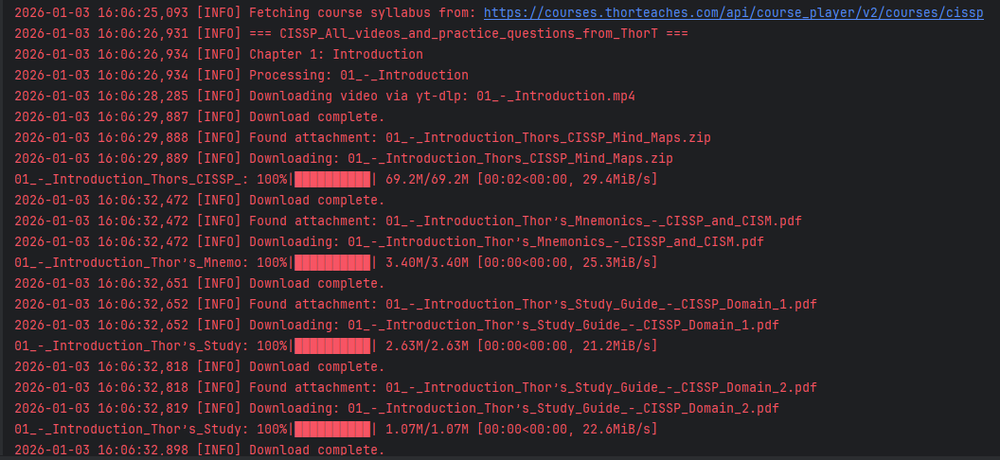
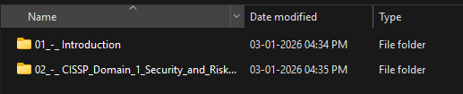

# Thinkific Course Downloader

A Python script to automate the downloading of course videos and attachments from Thinkific-based learning platforms.

## 🌟 What's New

* **!NEW! Download Quizzes:** Automatically fetches MCQs and saves them as interactive HTML files with clickable answers and explanations.
* **!NEW! Chapter Selection:** Interactive menu to select specific chapters to download (e.g., `1-5`, `10`, or `all`).
* **!NEW! Resumable Downloads:** Smartly checks for existing files. If a download is interrupted, just run the script again to pick up where you left off.
* **!NEW! Shared Files:** Automatically detects and downloads all "Shared Files" and lesson attachments.
  
## 📋 Prerequisites

* Python 3.8+
* `ffmpeg` (Required for video processing)

## 📷 Screenshot




## 📦 Installation

1.  **Clone the repository:**
    ```bash
    git clone https://github.com/0xsharz/thinkific-downloader-latest.git
    cd thinkific-downloader
    ```

2.  **Install dependencies:**
    ```bash
    pip install -r requirements.txt
    ```

## ⚙️ Configuration

1.  Create a file named `.env` in the root directory.
2.  Add the following details (you must be enrolled in the course):

    ```ini
    # URL of the course syllabus (e.g., https://courses.example.com/api/course_player/v2/courses/course-slug )
    COURSE_LINK=

    # Your login cookie from the browser
    COOKIE_DATA=

    # Optional: Video Quality (720p, 1080p). Defaults to 720p.
    VIDEO_DOWNLOAD_QUALITY=720p
    ```

### How to get your Cookie Data:
1.  Log in to the course website.
2.  Open Developer Tools (**F12**) and go to the **Network** tab.
3.  Refresh the page.
4.  Find the request with endpoint /api/course_player/v2/courses/.
5.  Scroll to **Request Headers** and copy the value of `Cookie`.

## ▶️ Usage

Run the script to start downloading:

```bash
python main.py 
```


##  ⚠️ Disclaimer
This tool is for personal archiving purposes only. This script only downloads enrolled courses from thinkific based website. Owner of this repository is not responsible for any misuse if you share your credentials with strangers. Please respect the Terms of Service of the platform.
